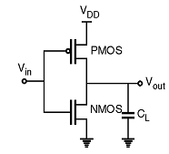
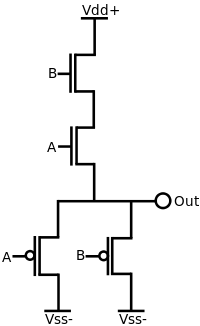
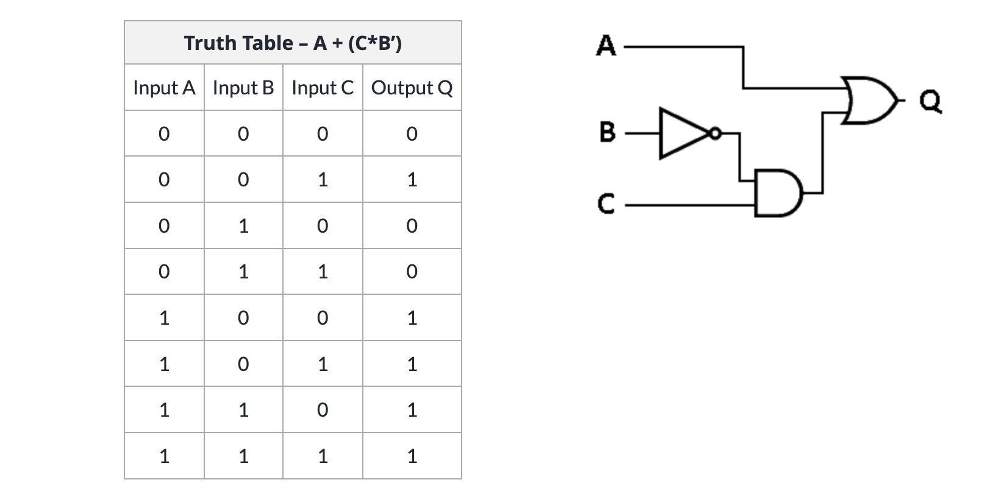
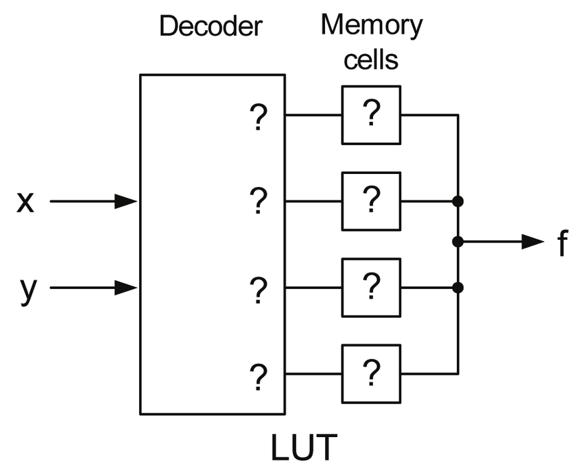
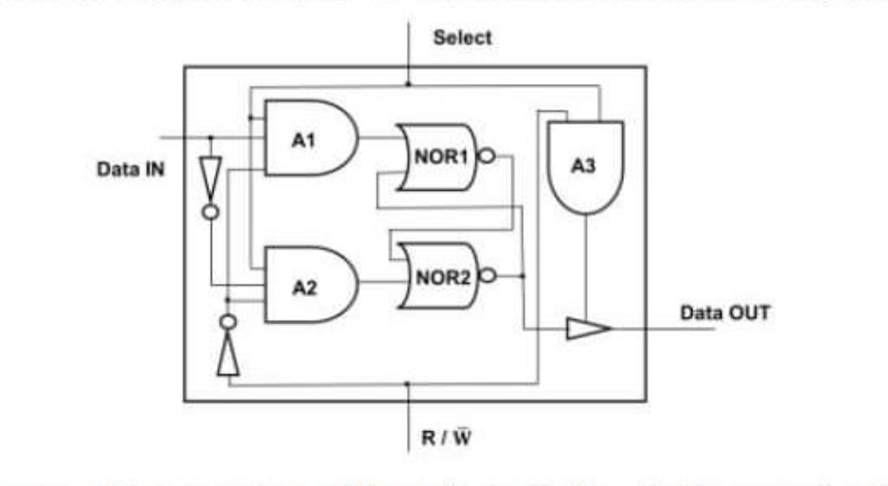

# Prompt

So about those transistors -- Course overview. Describe how FPGAs are buildable using transistors, and that ICs are just collections of transistors in a nice reliable package. Understand the LUTs and stuff. Talk briefly about the theory of transistors, but all projects must build on each other so we can’t build one.

# Answer

### Basics of Transistors

Transistors affect current using three terminals. One terminal is used to control current flow between the other two terminals.

In digital electronics, Metal-Oxide-Semiconductor Field Effect Transistors (MOSFETs) are most often used. There are three main flavors of this type of transistor: positively doped (PMOS), negatively doped (NMOS), or complementary (CMOS). The dominant flavor in modern digital electronics is CMOSFET.

A complementary mosfet (CMOS) is a configuation of both NMOS and PMOS transistors such that a transistor, rather than a resistor, is used for the load. This imporoves power usage and performance.

Because one gate controls current through the other two gates, transistors can be used to implement boolean logic. Here are a few CMOS logic gates:

    <figure>
        
        <figcaption>NOT</figcaption>
        

            Vin high closes the PMOS gate and opens the NMOS gate. The result is that Vout is tied to ground. Vin low opens the PMOS gate and close the NMOS gates. Vout is then tied to high and shutoff from ground.
        

    </figure>
    <figure>
        
        <figcaption>AND</figcaption>
        

            If either A or B is low, OUT will low as the PMOS gates will be open. Unless both A and B are high, the NMOS series will not allow current to Vout.
        

    </figure>

### Transistors and FPGAs

Because we know transistors can be used to implement boolean logic, we can think in terms of boolean logic, rather than transistors. We can then rephrase the question, how are FPGAs 
built using boolean logic?

FPGAs are fundamentally programmable via reconfigurable Lookup Tables (LUTs) and reconfigurable interconnects. First, LUTs are software or hardware components that map inputs to outputs. We will focus on the hardware LUT.

Strictly adhering to the above definition of LUT, a single logic gate, like the CMOS ones pictured above, can be considered a LUT. But, in reality, LUTs are used for more "complex"
boolean equations. Consider:

    <figure>
        
     <figcaption>unconfigurable LUT</figcaption>
    <gig>

But, the above LUT is not reconfigurable, meaning we cannot change what inputs map to what outputs.

A reconfigurable LUT is one that can change its truth table. These are usually implemented with a decoder or multiplexer and a set of memory cells. To configure an LUT of this type, the memory cells are overwritten.

<figure>
    
    <figcaption>configurable LUT</figcaption>
</figure>

Then, decoders and memory can be implemented in boolean logic (and thus using transistors):

<figure>
    
    <figcaption>SRAM cell</figcaption>
</figure>

<figure>
    
    <figcaption>Decoder</figcaption>
</figure>

The second fundamental component of FPGAs are reconfigurable innterconnects.

TODO - interconnects
TODO - IC
TODO - transistor theory